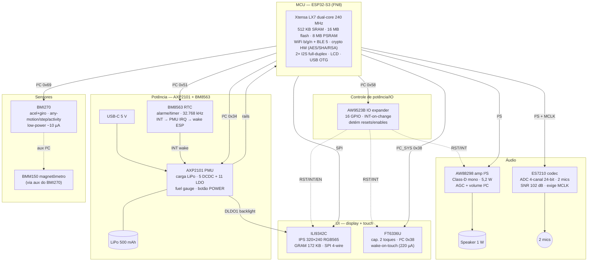

# M5Stack CoreS3 — Capacidades para o Tamagotchi

> Avaliação das capacidades de hardware do **M5Stack CoreS3** (SKU K128) como
> plataforma da variante **Tamagotchi** do Robô Felipe — um pet de bolso
> conversacional para o **Sobrinho** (8 anos), autocontido, sem relay de
> smartphone (ADR-016). Especificações extraídas dos datasheets oficiais dos
> fabricantes via skill `datasheet-finder` (busca LCSC + conversão de PDFs).
> Esta é a documentação de referência que faltava no placeholder `cores3/`.

---

## 1. Por que o CoreS3 é o candidato (resumo)

O ADR-016 estabelece a restrição decisiva: o Tamagotchi precisa **terminar TLS
ele mesmo** (sem relay), o que exige **PSRAM** — eliminando o WROOM-32E-N4
(ADR-001) e o StampS3 do Cardputer. O CoreS3 entrega num só objeto:

- **ESP32-S3 + 8 MB PSRAM + 16 MB flash** — RAM suficiente para TLS + buffers
  de áudio + modelos KWS/TTS.
- **Áudio embutido** — codec ES7210 (2 mics) + amp AW88298 (speaker I2S).
- **Display touch** — IPS 2,0" 320×240 (ILI9342C + FT6336U).
- **Bateria + gestão de potência** — AXP2101 + BM8563 (RTC) + LiPo 500 mAh.
- **IMU** — BMI270 (acel + giro + magnetômetro BMM150 via aux).
- **USB-C OTG/CDC** — programação e alimentação.

Ou seja: quase todo o subsistema de hardware do Tamagotchi já vem montado na
placa — incluindo **câmera GC0308** e sensor de proximidade, que entram no
escopo via ADR-017. O trade-off restante é ser maior que um StampS3.

---

## 2. Diagrama de blocos (chips onboard)



---

## 3. MCU — ESP32-S3 (o coração do Tamagotchi)

Datasheet oficial Espressif v1.7. LCSC: chip bare **ESP32-S3R8 C2913194**
(US$ 3,16) / módulo **ESP32-S3-WROOM-1-N16R8 C2913202** (US$ 5,14).

| Capacidade | Valor (datasheet) | Por que importa p/ Tamagotchi |
|:--|:--|:--|
| CPU | Xtensa LX7 **dual-core 240 MHz**, FPU single, **128-bit SIMD (PIE)** | Um core cuida do I²S/áudio, outro do TLS/UI; SIMD acelera KWS (TFLite-Micro/ESP-NN) |
| SRAM interna | **512 KB** + 384 KB ROM + 16 KB RTC | Stack/buffers críticos em SRAM rápida |
| **PSRAM** | **8 MB octal** (S3R8) — compartilha bus SPI0/1 com a flash, CS separado | **Satisfaz ADR-016**: TLS (~40–50 KB) + ring buffers de áudio + modelos vivem na PSRAM |
| Flash | 16 MB quad (no módulo CoreS3) | Firmware + CA bundle + assets de UI do pet |
| WiFi | 802.11 b/g/n, STA/AP/STA+AP, TX 21 dBm | Conecta direto à Nuvem em qualquer WiFi (casa/escola) |
| BLE | **Bluetooth 5 (LE) + mesh**, +20 dBm | Provisionamento de WiFi por BLE (sem app) |
| **Crypto HW** | AES-128/256, SHA-1/224/256/384/512, **RSA até 4096**, HMAC, RNG, Secure Boot, XTS-AES | **Termina TLS (mbedTLS) sem relay** — ADR-016 validado |
| **I²S** | **2× I²S**, full-duplex, 8/16/24/32-bit, BCLK 10 kHz–40 MHz, **PDM** + TDM | RX (mic) e TX (speaker) simultâneos; PDM suporta mics digitais |
| LCD | Interface 8–16-bit paralela RGB/i8080/6800 a 40 MHz | Poderia driver LCD paralelo, mas CoreS3 usa SPI |
| Touch cap. | **14 canais** (GPIO1–14) | Touch no próprio ESP32 (CoreS3 usa FT6336U externo, mas fica como opção) |
| GPIO | **45 GPIO**, GPIO matrix (qualquer pino → qualquer periférico) | Pinout flexível; strapping pins: GPIO0/3/45/46 |
| USB | **USB 2.0 OTG** + USB Serial/JTAG (CDC) | Programação plug-and-play e alimentação pela USB-C do CoreS3 |
| Low-power | Deep-sleep **8 µA** (RTC on); Light-sleep 240 µA (+140 µA c/ PSRAM octal) | Pet "dorme" gastando quase nada |
| ⚠️ | **ADC2 inutilizável com WiFi ligado** | Sensar bateria no **ADC1** (GPIO1–10), nunca no ADC2 |

> **Nota de toolchain:** `.vscode/arduino.json` ainda aponta para board WROOM
> (`PSRAM=disabled`). Para o CoreS3 é preciso trocar para uma board ESP32-S3
> com PSRAM habilitada. Config de referência (PlatformIO, da docs M5Stack):
> `board = esp32-s3-devkitc-1`, flags `-DBOARD_HAS_PSRAM -mfix-esp32-psram-cache-issue
> -DARDUINO_USB_CDC_ON_BOOT=1 -DARDUINO_USB_MODE=1`. Ainda não configurada.

---

## 4. Áudio — ES7210 + AW88298 (vs. BOM do projeto)

Os chips de áudio do CoreS3 **substituem** o BOM de breakout (`SPH0645LM4H` +
`MAX98357A`) caso a placa seja adotada. LCSC: **ES7210 C365743** (US$ 0,90) /
**AW88298 C5162557** (US$ 1,07).

### Comparação direta com o BOM (`hardware/audio/BOM-audio.md`)

| Característica | BOM (breakouts) | CoreS3 (embutido) | Impacto |
|:--|:--|:--|:--|
| **SNR do mic** | 65 dB(A) (SPH0645) | **102 dB** (ES7210) | ES7210 muito melhor → KWS mais robusta em ruído |
| **16 kHz nativo** | Não (32–64 kHz → downsample 48→16) | **Sim** (8–48 kHz single-speed) | **Elimina a decimação FIR** do ADR-005 |
| **MCLK** | Nenhum dos dois precisa | **ES7210 exige MCLK** (256×Fs, até 51,2 MHz) | ⚠️ **Novo requisito** — gerar/rotear MCLK no ESP32-S3 |
| **Amp: potência** | 1,8 W @ 8Ω (5 V) | **5,2 W @ 8Ω** (boost 10,25 V) | Headroom enorme p/ speaker de 1 W |
| **Amp: eficiência** | 92% | 84% (SmartBoost+Class-D) | BOM levemente melhor em bateria |
| **Amp: THD+N** | 0,02% @ 1 W | 0,02% @ 1 W | Equivalentes |
| **Amp: filtro** | **Filterless** (speaker direto) | ⚠️ **Não declarado filterless** (medido c/ 8Ω+33 µH) | Confirmar ferrite/filtro no layout |
| **Controle** | Pinos (GAIN_SLOT, SD_MODE) | **I²C** (AW88298 0x36, ES7210 0x40) | Totalmente por software — volume, AGC, mute |
| **DSP no chip** | Voice-mode IIR no amp | AGC + volume + DC-cancel; **sem AEC** | ⚠️ **AEC/acoustic echo tem de vir do firmware** |
| **Mics** | 1 mic I²S digital | **4 canais analógicos diferenciais** (2 onboard) | Array de mic possível |

### Riscos de integração do áudio (atenção)

1. **MCLK do ES7210** — o path atual (SPH0645 + MAX98357) não usa MCLK. O
   ES7210 exige um master clock (~256×Fs). O ESP32-S3 precisa gerar esse sinal
   (pino I2S_MCLK = **GPIO0** no CoreS3). **GPIO0 é strapping pin** (boot mode) —
   verificar se manter MCLK em GPIO0 no boot não conflige com strapping.
2. **Sem AEC em nenhum chip** — num brinquedo onde o speaker toca TTS perto do
   mic, o eco acústico precisa de AEC no firmware do ESP32-S3 (ou VAD agressiva
   que silencie o speaker ao captar voz).
3. **Filtro de saída do AW88298** — o MAX98357A é "filterless"; o AW88298 é
   medido com indutor série. Confirmar no esquema do CoreS3 se há ferrite/LC.
4. **Amp superdimensionado** (5,2 W) p/ speaker de 1 W — usar AGC + volume
   por I²C para limitar e proteger o speaker.

---

## 5. Display + Touch — ILI9342C + FT6336U (a UI do pet)

LCSC: nenhum dos dois é vendido como IC nu (só o módulo CoreS3). Datasheets
oficiais Ilitek (v1.01) e FocalTech (v1.1).

### ILI9342C — display do pet

- **320×240 RGB565** (65K cores), GRAM onboard de **172.800 bytes** (frame
  buffer completo — sem precisar da PSRAM p/ frame).
- **SPI 4-wire** até ~10 MHz (escrita) / 6,67 MHz (leitura).
- **Window addressing** (`2Ah`/`2Bh`) + **Partial Mode** (`12h`) → redesenhar
  só a boca/olhos do pet sem tocar no resto (animação eficiente).
- **Scroll vertical** (`33h`) → ticker de status ("estou com fome...").
- **Sleep** (`10h`): DC/DC e oscilador param, **GRAM retida**; backlight
  cortado pelo AXP2101 DLDO1.
- **TE (Tearing Effect)** pin → animação sem tearing.

### FT6336U — toque do Sobrinho

- **Capacitivo self-cap, até 2 toques** + gestos (swipe). Sem 5/10-toque.
- **Wake-on-touch**: em modo Monitor (~220 µA) → detecta toque → entra Active
  automaticamente. **Pet "acorda" quando a criança toca o vidro.**
- I²C 0x38 (confirmado), INT ativa-low.
- Correntes: Active 4,32 mA · Monitor 220 µA · **Hibernation 55 µA**.
- ⚠️ Sem water-rejection/glove no datasheet — mão suja/molhada pode gerar
  toque espúrio (relevante p/ criança de 8 anos).

---

## 6. Energia — AXP2101 + BM8563 (bateria e ciclo "vivo")

LCSC: **AXP2101 C3036461** (US$ 1,66) / **BM8563ESA C269877** (US$ 0,21).

### AXP2101 — gestão de potência

- **Carrega LiPo**: corrente 0–1000 mA (default 300 mA), tensão-alvo 4,0–4,4 V
  (default 4,2 V), pré-carga/trickle/terminação. Limite de corrente USB
  100/500/900/1000/1500/2000 mA.
- **16 rails**: 5 DCDC + 11 LDO. Alimenta ESP32-S3 (3,3 V), flash/PSRAM (1,8 V),
  backlight (DLDO1), sensores.
- **Fuel gauge (E-Gauge)**: reporta **% de bateria** (REG A4H) — vira a "barra
  de energia do pet". ⚠️ É estimativa por modelo/tensão, **não** coulomb
  counter — tratar como aproximação.
- **Botão POWER em hardware**: short-press / long-press / bordas detectados no
  PMU (OFFLEVEL default 6 s). **Desligar o brinquedo não precisa de firmware.**
- **IRQ** (open-drain) reúne: inserção/remoção de USB, carga completa/início,
  bateria baixa, botão, e — crucial — **o alarme do RTC**.
- **Power-off < 40 µA** (só RTCLDO on) → bateria dura meses "desligado".

### BM8563 — RTC (o relógio do pet)

- **Alarme** (min/hora/dia/dia-da-semana c/ AE_x) + **timer countdown**
  (clock 4.096 kHz/64 Hz/1 Hz/1/60 Hz; máx ~4,25 h a 1/60 Hz).
- **INT open-drain → nó IRQ do AXP → wake do ESP32**. Zero polling: o pet
  "fica com fome" num timer sem a CPU gastar nada entre eventos.
- **CLKOUT** 32.768 kHz/1.024 kHz/32 Hz/1 Hz → slow clock do ESP32.
- ⚠️ Exige **cristal 32.768 kHz** externo; sem VBAT separado (alimentado pelo
  RTCLDO always-on do AXP).
- Corrente: **0,5 µA** (timekeeping, CLKOUT off) — irrelevante p/ bateria.

### Ciclo de vida "pet vivo" (mapeamento)

- **Acorda por timer** ("estou com fome em 2 h"): BM8563 countdown → INT →
  AXP IRQ → **deep-sleep wake** do ESP32.
- **Acorda por toque**: FT6336U monitor → INT (via AW9523B) → wake.
- **Acorda por manuseio**: BMI270 any-motion (low-power ~10 µA) → INT → wake.
- **Barra de energia = % da bateria** (AXP E-Gauge) → animação de "fome".
- **Desligar = segurar POWER 6 s** — puro hardware, sem código.
- **Hora de dormir (21:00)**: alarme diário do BM8563 → ESP faz o pet dormir.

### Estimativa de bateria (LiPo 500 mAh, só CoreS3)

Assumindo deep-sleep ESP32 8 µA + AXP ~40 µA + RTC 0,5 µA ≈ **I_deep ≈ 49 µA**
e despertar **1×/h por 10 s de voz na nuvem** (~200 mA médio ativo):

```
Energia/hora = deep 0,049 mA × (3590/3600) + ativo 200 mA × (10/3600)
            ≈ 0,049 + 0,556 ≈ 0,605 mAh/h  →  I_média ≈ 0,6 mA
Autonomia   ≈ 500 mAh / 0,6 mA ≈ 830 h ≈ ~35 dias
```

Em standby puro (pet dormindo, sem wakes): ≈ **425 dias**. **Cada despertar
horário de 10 s "custa" ~11 h de standby** — logo, encurtar as janelas de voz e
manter display/sensores desligados em deep-sleep alonga muito a bateria.

---

## 7. Sensores — BMI270 (interação "pegar/chacoalhar")

LCSC: **BMI270 C2836813** (US$ 3,63). Hospeda o **BMM150** (magnetômetro) via
aux I²C → 9 eixos lidos por um único dispositivo (0x69).

- Acel: ±2/4/8/16 g · Giro: ±125–2000 dps · I²C 1 MHz / SPI 10 MHz.
- **Recursos em hardware** (sem a CPU pollar): **any-motion / significant-
  motion, step counter, activity (still/walk/run), wrist-wear wake**. Tudo roda
  em **low-power accel-only ~10–13 µA** → o pet reage ao ser pego sem gastar.
- 2 pinos INT configuráveis → wake do ESP32 por movimento.
- ⚠️ **Exige upload de um config-file de 8 KB a cada boot** antes de qualquer
  feature funcionar — deve ir embarcado no firmware.
- ⚠️ Não tem tap/double-tap/free-fall explícitos — "chacoalhar" = any-motion
  com threshold calibrado.
- ⚠️ O **girocustódio custa potência** (420 µA c/ giro vs 10 µA só acel) —
  para um brinquedo, rodar accel-only e deixar o giro em suspend.

### Como habilita a interação do pet

- **Any-motion wake**: o pet "se mexe" ao ser pego, com ESP32 dormindo.
- **Step counter**: "o pet andou N passos hoje" — gamificação p/ o Sobrinho.
- **Activity recognition**: deitado/andando/correndo → humor do pet muda sozinho.

---

## 8. IO expander — AW9523B (libera GPIO do ESP32)

LCSC: **AW9523B C148077** (US$ 0,33). 16 GPIO em 2 bancos, I²C 0x58, INT-on-
change (8 µs debounce), shutdown < 0,1 µA. No CoreS3 detém **resets/enables**
dos periféricos (LCD RST, touch RST/INT, câmera RST, amp RST/INT, BUS_OUT_EN,
USB_OTG_EN) — poupa 8 GPIO do ESP32 e concentra os INTs num só pino.

---

## 9. Pinmap do CoreS3 (alocação de GPIO do ESP32-S3)

| Função | GPIO | Barramento |
|:--|:--|:--|
| **I²C de sistema** (BMI270, AXP2101, BM8563, ES7210, AW88298, FT6336U, GC0308, LTR553) | SDA=**12**, SCL=**11** | I²C_SYS (compartilhado) |
| **I²S áudio** (ES7210 + AW88298 compartilham BCK/WCK) | BCK=**34**, WCK=**33** | I²S |
| Mic data in (ES7210) | DATI=**13** | I²S RX |
| Amp data out (AW88298) | DATO=**14** | I²S TX |
| **MCLK** do ES7210 | **0** ⚠️ strapping | clock |
| **LCD** (ILI9342C) | MOSI=**37**, SCK=**36**, CS=**3**, DC=**35** | SPI |
| microSD | MISO=**35**, MOSI=**37**, SCK=**36**, CS=**4** | SPI (compartilhado c/ LCD) |
| Câmera GC0308 | D0–D7=39/40/41/42/15/16/48/47, PCLK=45, VSYNC=46, HREF=38 | DVP |
| Port.A (HY2.0-4P) | SDA=**2**, SCL=**1** | I²C/GPIO |
| Port.B | **9**, **8** | GPIO |
| Port.C | TX=**17**, RX=**18** | UART |
| I²S extra no bus | DOUT=**13**, LRCK=**0**, DIN=**14** | M5-Bus |

> **Atenção:** GPIO0 (MCLK do ES7210), GPIO3 (LCD CS), GPIO45/46 são **strapping
> pins**. GPIO45 controla VDD_SPI (3,3 vs 1,8 V). Garantir níveis seguros no
> boot antes desses periféricos serem inicializados.

---

## 10. Avaliação de adequação ao Tamagotchi

### ✅ Pontos fortes (encaixe direto)

- **PSRAM octal de 8 MB** — satisfaz exatamente a restrição do ADR-016 (TLS
  sem relay). O motivo principal da escolha.
- **Áudio embutido com 16 kHz nativo** e SNR muito superior ao BOM → KWS mais
  simples e robusta, **sem decimação** (simplifica o ADR-005).
- **Display touch** de fábrica → UI do pet sem BOM de display.
- **Gestão de bateria + RTC** prontos → ciclo "vivo" (sleep/wake/fome) com
  autonomia estimada de ~1 mês despertando hourly.
- **Wake-on-touch e wake-on-motion** em hardware → pet reage ao manuseio.
- **USB-C OTG/CDC** → programação e carga fáceis; nada de FTDI.

### ⚠️ Riscos / pontos de atenção

| Risco | Detalhe | Mitigação |
|:--|:--|:--|
| **MCLK do ES7210 em GPIO0 (strapping)** | Path de áudio atual não usa MCLK; o ES7210 exige 256×Fs em GPIO0, que é strapping de boot mode | Validar que MCLK em GPIO0 no boot não impede SPI boot (GPIO0 alto = SPI boot ok; mas clock ativo pode interferir) |
| **Sem AEC em chip nenhum** | Speaker TTS perto do mic gera eco | AEC no firmware do ESP32-S3, ou VAG que silencie o speaker ao captar |
| **Filtro de saída do AW88298** | Não é filterless como o MAX98357A | Confirmar ferrite/filtro no esquema do CoreS3 |
| **Câmera GC0308 no escopo** (ADR-017) | Ocupa ~12 GPIO do barramento DVP + memória/CPU | Driver DVP + pipeline de visão em janelas curtas; desligar o rail no deep-sleep |
| **Sem 5/10-toque** | FT6336U: só 2 toques + gestos | Manter interação em tap/swipe (suficiente p/ 8 anos) |
| **Fuel gauge é estimativa** | AXP E-Gauge não é coulomb counter | Tratar "% de bateria" como aproximação; calibrar a "barra de fome" |
| **BMI270 precisa de config-file** | 8 KB a cada boot | Embarcar `bmi270_config_file` no firmware |
| **24 V DC via DinBase** não passa pelo AXP | Precisa de pré-regulador buck na base | Alimentar sempre por USB-C 5 V no uso como brinquedo |

---

## 11. Câmera GC0308 + sensor de proximidade (no escopo — ADR-017)

O CoreS3 traz, na mesma fita ribbon, uma **câmera GC0308** (0,3 MP, barramento
DVP) e um **sensor de proximidade/luz LTR-553ALS-WA** (I²C @ 0x23). Pelo
ADR-017, ambos entram no escopo do Tamagotchi — o Sobrinho quer a câmera como
parte da interação, e a câmera não conflita com a premissa "autocontido, sem
relay" do ADR-016 (é um periférico local, não um segundo dispositivo).

- **Câmera (GC0308):** interface SCCB (I²C @ 0x21) para configuração +
  barramento paralelo DVP de 8 bits (D0–D7) + PCLK/VSYNC/HREF no controlador
  DVP do ESP32-S3 (~12 GPIO dedicados). Reset controlado pelo expansor
  AW9523B (P1_0), sem GPIO novo do ESP32.
- **Sensor de proximidade (LTR-553ALS-WA):** pode detectar a mão perto do
  vidro → "pet acorda ao ver o Sobrinho", complementando wake-on-touch e
  wake-on-motion.
- **Integração:** visão deve rodar em janelas curtas (ou num core separado)
  para não competir com o pipeline de voz (TLS + áudio + KWS), que já é o
  gargalo de latência. Em deep-sleep o AXP2101 corta o rail da câmera.

> Esta seção **supersede**, para a variante Tamagotchi, a menção "câmera
> (indesejada)" do ADR-016 — ver ADR-017 para a decisão registrada.

---

## 12. Referências (datasheets consultados)

| Componente | Fabricante | Revisão | Fonte |
|:--|:--|:--|:--|
| ESP32-S3 | Espressif | v1.7 (2023-06) | LCSC C2913194 / C2913202 |
| AW88298 | Awinic | v1.6 (2022-05) | LCSC C5162557 |
| ES7210 | Everest Semi | rev 9.1 (2019-01) | LCSC C365743 |
| ILI9342C | Ilitek | v1.01 (2011-12) | mirror logictechno (não no LCSC) |
| FT6336U | FocalTech | v1.1 | mirror Adafruit CDN (não no LCSC) |
| AXP2101 | X-Powers | v1.4 (2022-10) | LCSC C3036461 |
| BM8563 | (clone PCF8563) | s/data | LCSC C269877 |
| BMI270 | Bosch Sensortec | rev 1.3 (2020-11) | LCSC C2836813 |
| AW9523B | Awinic | v1.1.1 (2016-05) | LCSC C148077 |

PDFs e textos extraídos ficam em `/tmp/opencode/datasheets/` (fora do repo).
Especificações da placa e pinmap: [docs M5Stack — CoreS3](https://docs.m5stack.com/en/core/CoreS3)
e [esquema PDF oficial](https://m5stack-doc.oss-cn-shenzhen.aliyuncs.com/490/Sch_M5_CoreS3_v1.0.pdf).

---

## 13. Próximos passos sugeridos

1. **Confirmar o esquema do CoreS3** (`Sch_M5_CoreS3_v1.0.pdf`) para: (a) o
   filtro de saída do AW88298, (b) o circuito do MCLK em GPIO0, (c) a divisão
   de rails do AXP2101.
2. **Configurar o toolchain** ESP32-S3 + PSRAM no `.vscode/arduino.json`
   (substituir a board WROOM atual).
3. **Decidir áudio embutido vs. BOM de breakout** — se adotar o CoreS3, o
   ES7210+AW88298 substituem o SPH0645+MAX98357 (registrar em nova ADR de
   hardware do Tamagotchi, conforme sugerido no ADR-016).
4. **Prototipar o wake chain** (RTC/ touch/ motion → deep-sleep wake) — é o
   coração do "pet vivo" e o maior risco de UX.
5. **AEC no firmware** — endereçar o eco acústico antes de refinar a KWS.
