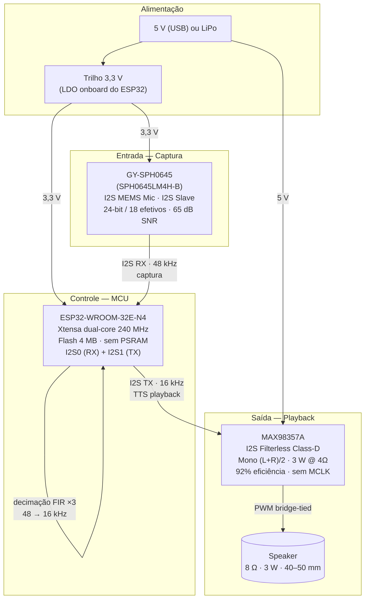
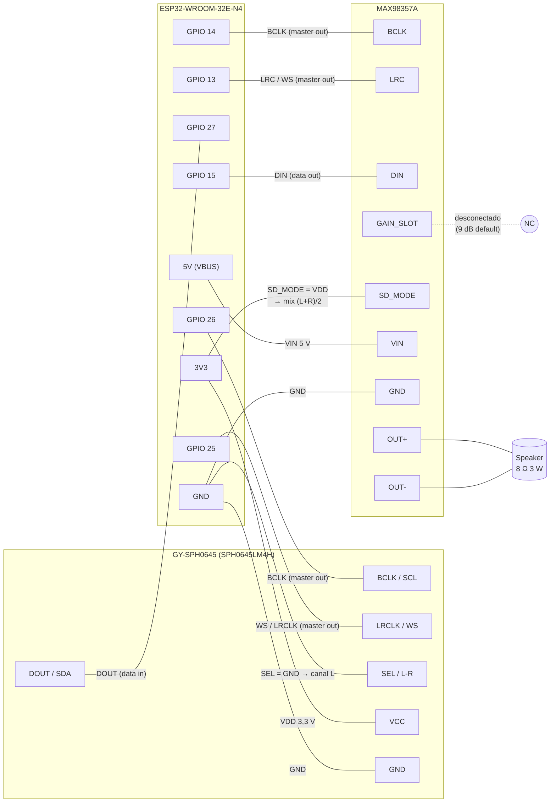
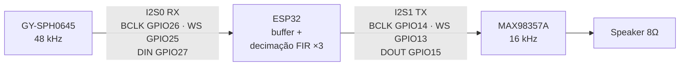
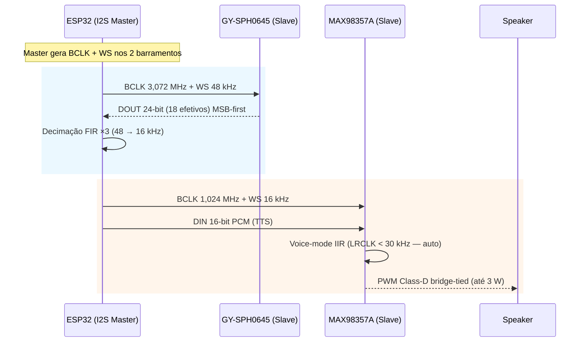

# Esquema Técnico: ESP32-WROOM-32E-N4 + GY-SPH0645 + MAX98357A

> Esquema de interligação do subsistema de áudio do robô Felipe.
> Pinagem e specs validados contra `BOM-audio.md` e
> `esp32-wroom-32e-n4.md` (diagnóstico de hardware confirmado).
> Diagramas Mermaid gerados conforme a skill `mermaid-diagram-generator`.

---

## 1. Diagrama de Blocos do Sistema

Fluxo de potência e dados entre os três módulos e o alto-falante.

---

## 2. Esquema de Interligação (pin-to-pin)

Pinagem fı́sica GPIO ↔ pino de cada breakout. Os rótulos `SCL/SDA` do
GY-SPH0645 são apenas nomes alternativos do fabricante — o barramento é
**I2S, não I2C**.

---

## 3. Fluxo de Sinais I2S e Conversão de Sample Rate

Por que dois periféricos I2S: o mic captura a **48 kHz** (dentro da spec
2,048–4,096 MHz de BCLK do SPH0645LM4H) e o amp reproduz **16 kHz**
(TTS). O ESP32 faz decimação FIR ×3 no firmware entre os dois caminhos.

---

## 4. Diagrama de Temporização I2S

Sequência de sinais no barramento (ESP32 é master em ambos os canais).

---

## 5. Tabela de Pinagem (resumo)

| Função | GPIO ESP32 | Pino GY-SPH0645 | Pino MAX98357A |
|:---|:---|:---|:---|
| Mic BCLK (master out) | GPIO 26 | BCLK / SCL | — |
| Mic WS / LRCLK (master out) | GPIO 25 | LRCLK / WS | — |
| Mic DOUT (data in) | GPIO 27 | DOUT / SDA | — |
| Mic SEL (canal L) | GND | SEL / L-R | — |
| Mic VDD | 3V3 | VCC | — |
| Amp BCLK (master out) | GPIO 14 | — | BCLK |
| Amp LRC / WS (master out) | GPIO 13 | — | LRC |
| Amp DIN (data out) | GPIO 15 | — | DIN |
| Amp GAIN_SLOT | desconectado | — | GAIN (9 dB default) |
| Amp SD_MODE | 3V3 | — | SD_MODE → mix (L+R)/2 |
| Amp VIN | 5V (VBUS) | — | VIN |
| Amp GND | GND | — | GND |
| Amp OUT+/OUT− | — | — | Speaker 8 Ω (bridge-tied, sem GND) |

---

## 6. Notas de Integração

- **Sem MCLK**: o MAX98357A não requer MCLK — poupa 1 GPIO (confirmado no
  datasheet).
- **Strapping pin GPIO 15**: também é `MTDO`. O DIN do MAX98357A é entrada
  com pull-down interno no amp, mantendo o pino baixo no boot — sem conflito
  de strapping. Evite pull-up externo neste pino.
- **GPIO 12 (MTDI) NÃO usado**: permanece livre, evitando o problema de
  tensão de flash no boot.
- **PSRAM ausente** (confirmado por diagnóstico): buffers de áudio residem na
  SRAM (~325 KB livres). Um buffer de anel de 16 kHz · 16-bit · 250 ms ≈
  8 KB — folga ampla.
- **Compartilhamento de BCLK/WS**: só é possível entre mic e amp se rodarem
  na mesma sample rate. Como diferem (48 kHz vs 16 kHz), usam-se periféricos
  I2S separados (I2S0 = RX, I2S1 = TX).
- **Ganho do amp**: GAIN_SLOT desconectado = 9 dB (volume moderado). Subir
  para 12 dB (GND direto) se o TTS ficar baixo a 1 m.
- **Speaker bridge-tied**: OUT+ e OUT− vão direto ao speaker, **sem GND** e
  sem filtro (Filterless Class D).

---

## 7. Referências

- `hardware/esp32-wroom-32e-n4.md` — specs e diagnóstico do MCU
- `hardware/BOM-audio.md` — pinagem I2S e specs de SPH0645LM4H / MAX98357A
- Datasheet SPH0645LM4H-B (Knowles) — Adafruit CDN
- Datasheet MAX98357A (Maxim/Analog Devices) — Adafruit CDN
